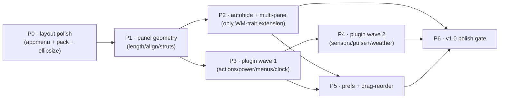

# Wafflebar → xfce4-panel parity roadmap (P0–P6)

> **Grounding note.** This roadmap was refined in a remote session whose clone contains only
> `README.md`, `LICENSE`, and `docs/{ARCHITECTURE,PRIOR_ART}.md` — the implementation lives in
> the author's **local, unpushed** working copy. All file paths and line numbers below are
> carried over from the source plan **on the author's word and were not re-verified against
> source**. Treat every `path:line` as "confirm at implement time"; the *shape* of each change is
> the part to review.

## Context

Wafflebar already runs as a real Wayland panel on dwl — every plugin populated with live data,
themed Nord/Dawn. Daily-driving it surfaced three concrete gaps:

1. **No applications menu on the bar.** The `appmenu` plugin exists and is fully WM-independent
   (it builds from `.desktop` enumeration via `core::menu`/`core::freedesktop`/`core::recents`,
   not the WM backend), but it is absent from both the default config and the user's config.
2. **Large gaps between modules**, and
3. **Long labels bleeding off the right edge.**

(2) and (3) share one root cause: the layout is a `gtk4::Grid` built `column_homogeneous(true)`
with every module container `hexpand(true)` (`app.rs:253-256, 281`). All 12 columns are forced
to equal width (~160px on a 1920px monitor); `align=end` content hugs slot edges (→ the gaps)
and long labels overflow their slot toward the monitor edge (→ the bleed).

**Goal:** evolve wafflebar into a Wayland-feasible **xfce4-panel equivalent** for tiling WMs
(dwl/sway/i3), shipped as a phased arc. **P0 is executable immediately**; P1–P6 are the
committed roadmap, each a release-worthy increment, spec'd in detail when reached (per the
project's design-note → sign-off → implement → verify workflow).

### Inventory correction (the external roadmap had stale claims)

| External claim | Reality (per author / draft) |
|---|---|
| `showdesktop` missing | **Exists, complete** — `plugins/showdesktop.rs` (cap-gated; renders Empty when WM lacks support) |
| `separator` partial | **Complete** — 4 styles + `expand` flag, `plugins/separator.rs:18-62` |
| `tasklist` ellipsize missing | **Exists** — `max_chars` + `…`, `plugins/tasklist.rs:26,57,134` |
| `launcher` "favorites only" | **Real plugin** — `items` array + right-click `.desktop` Actions menu, `plugins/launcher.rs` (no multi-item arrow popup — that part is a genuine gap) |
| `clock` multi-mode | **Confirmed gap** — digital-only strftime; no analog/binary/fuzzy/lcd (`plugins/clock.rs`) |
| `appmenu` not in default config | **Confirmed** — exists + WM-independent, just unlisted (`plugins/appmenu.rs`) |
| WM exposes window geometry | **Confirmed gap** — no focused-window rect on the trait (`wm.rs:103-124`); intelligent autohide needs a trait extension |

## Cross-cutting decisions (apply across all phases)

- **Default `[bar] layout = "pack"`.** Single-row configs auto-render as a tight edge-packed
  panel. The homogeneous grid becomes opt-in (`layout = "grid"`) and is auto-selected for any
  `rows > 1` config. ("Grid is the differentiator" → "grid is the power-user / multi-row option.")
- **`actions` plugin talks to `org.freedesktop.login1` directly** via zbus (Suspend / Hibernate /
  HybridSleep / PowerOff / Reboot; `Session.Lock` or a configurable lock command) — not through an
  xfce4-session intermediary. Matches every modern Wayland panel.
- **`pager` is a thin alias to `tags`**, not a second workspace plugin (exposes
  `rows`/`workspace_scrolling`; button-mode only — miniature view needs libwnck = X11-only).
- **Plugin discovery stays a compile-time registry** (`plugins/mod.rs` `catalog()`/`build()`),
  not `.desktop` scanning. The `unique` flag (currently only `statustray`) gates singletons.
- **WindowManager trait is extended exactly once** (P2, for intelligent autohide). Everything
  else is additive within the existing Module/View/Schema substrate — consistent with the
  ARCHITECTURE invariant that no GTK type ever crosses the `Module`/`View`/`Event` boundary.
- **`span-monitors` is best-effort** (mirrored per-monitor bars); single-surface span is unsolved
  on Wayland even upstream — document the limitation.
- Per-milestone PRs off the current dev tip; small conventional commits; **user owns the merge
  gate**. In-flight theming PRs (#36 `#grid`, #37 `v4_18`, #38 PR2) are independent of this work.

### Versioning

Ship **0.1.0**, not 1.0 — the config schema is the public API and hasn't met real users, so
reserve 1.0 for schema stability. Release-tag each phase: ≈0.5 after P1, 0.6 after P2, 0.8 after
P3, 0.9 after P4, 0.95 after P5, **1.0 after P6**.

## Phase dependency graph



---

## P0 — Visible-layout polish (EXECUTABLE NOW · ~3 PRs · ~250 LOC)

The three things the user saw. No trait changes, no risk to the Module/WM contract.

### L1 — Applications menu in config (config-only)
- Add an `appmenu` module to the user's `~/.config/wafflebar/config.toml` **and** to the built-in
  default config (`config.rs:~240-265`, currently clock-only).
- Keys already supported (`plugins/appmenu.rs:73-82`): `icon`, `label`, `show_recents`,
  `max_recents`, `favorites`.
- Verify it populates live from system `.desktop` files (WM-independent).

### L2 — CenterBox packing layout — the core fix (default `pack`)

**Shape of the change** (current → new):

```
            populate_grid()  [single fn, 247-299]
                     │
                     ▼  becomes a dispatcher returning (gtk4::Widget, Vec<PluginSlot>)
        ┌────────────────────────────────────────┐
        │ layout == Pack && engine.rows <= 1 ?    │
        └───────────────┬──────────────┬──────────┘
                   yes  │              │  no
                        ▼              ▼
              populate_pack()   populate_grid_inner()
              gtk4::CenterBox   = renamed current body
              #grid             gtk4::Grid (homogeneous)
              start/center/end  .upcast::<Widget>()
              Box groups        UNCHANGED behavior
              (content-sized,
               no hexpand)
```

- **`crates/wafflebar-core/src/config.rs`**: add `enum Layout { #[default] Pack, Grid }`
  (`#[serde(rename_all="lowercase")]`) near `Position` (~line 100); add
  `#[serde(default)] pub layout: Layout` to `BarConfig` (after `position`, ~line 65) and to its
  `Default` impl (~74-83).
- **`crates/wafflebar/src/app.rs`**: split `populate_grid()` (247-299) into the dispatcher above.
  - `populate_pack`: a `gtk4::CenterBox` named `#grid` (**keep the CSS selector stable**),
    `set_hexpand(true)`; three `gtk4::Box` groups (start/center/end) with matching `halign`;
    iterate `engine.placements` (already declaration-ordered), bucket each module's container by
    `placement.align` (`Start|Fill`→start, `Center`→center, `End`→end); **no per-container
    `hexpand`** (content-sized is the entire point); `set_start/center/end_widget`. No fillers.
  - Relax the `set_child(Some(&grid))` call sites (206-208, 320-321) to the `Widget` return
    (`&Widget` already satisfies the bound).
- Result: `align=start` packs flush-left, `align=end` packs flush-right, `align=center` centered;
  slack between groups is handled by CenterBox. **Existing `align=end` configs "just work"** with
  no expand-separator. `cell`/`colspan`/`rowspan` are ignored in pack mode (still validated by
  `GridEngine`, just unused) — document this.
- **`crates/wafflebar-core/src/grid.rs` — unchanged**; still validates placements in both layouts.

### L3 — Network label ellipsization (the remaining bleed)
- The right-edge bleed was the `network` label (e.g. `Wired connection 1`); `network` has no
  length bound (`plugins/network/mod.rs`). Mirror the existing pattern from `plugins/window.rs` /
  `plugins/tasklist.rs:26,57`: add a `max_chars` option + `…` truncation to the network label.
- Optional: factor a shared `truncate(s, max)` helper only if it earns its keep — there would be
  three consumers (window, tasklist, network), which is a reasonable threshold.

### P0 docs
- **`docs/config.md`**: document `[bar] layout`, the `align`→group mapping, that `cell`/`colspan`
  apply only to `layout="grid"`, and the new `network.max_chars` key.

### P0 verification
Live on dwl (`WAYLAND_DISPLAY=wayland-0`, primary at x≈1920):
1. `cargo build` + run a single-row config (left `align=start`, right `align=end`, centered clock,
   **no** expand separator).
2. `grim -g "1920,0 1920x26" /tmp/bar.png`, read it, PIL-pixel-sample row y≈13:
   - left group flush at x≈0, right group reaches x≈1919, **no pixels past the right boundary**,
   - clock midpoint ≈x960, inter-group gaps equal the theme background.
3. **Regression**: rerun with `layout="grid"` (or `rows=2`) → homogeneous columns unchanged.
4. **Live-reload**: flip `layout` in the running config → structural reload rebuilds without restart.
5. `cargo test` (both crates) green; clippy clean.

---

## P1 — Panel-level geometry (~8 PRs) · dep: P0 · no trait changes

Additive `BarConfig`/schema keys + PanelWindow math (`app.rs apply_bar_layout` 232-241):
`length_percent` (1–100 → layer-shell width = monitor_width × pct), `length_adjust` (auto-grow to
child preferred size, capped at `length_percent`), `alignment` (start|center|end placement when
length < 100), `border_width`, background `style`/`rgba`/`image` (CSS already supports
`background-image`), `reserve_space` (→ `set_exclusive_zone(0|computed)`), `keep_below`
(→ `Layer::Bottom`), `lock` (→ preferences disables move/edit/remove). TOML stores percent
directly (skip xfce's percent↔pixel bind-property transform). **Release ≈0.5.**

## P2 — Autohide & multi-panel (~10 PRs) · dep: P1

- `autohide="always"` — 1px hot-strip show/hide on pointer enter/leave; popup/popdown delays.
  PanelWindow-internal, **no trait change** — land this first.
- `autohide="intelligent"` — **the one WindowManager trait extension in the roadmap**: add
  focused-window geometry (`wm.rs` Window struct + a subscribe method). sway/i3 via IPC focus
  events (`wm/sway.rs`); dwl has no geometry via wlr-foreign-toplevel → fallback: hide when any
  non-floating window shares the workspace.
- **Multi-panel** — refactor to own `Vec<PanelInstance>` keyed by id; TOML becomes a `[[panel]]`
  array (schema sketch below); preferences gains a panel selector
  (`app.rs build_bars`/`present_bar` → PanelApplication-style enumeration, 29-114).
  **Release ≈0.6.**

## P3 — Plugin parity wave 1 (~12 PRs) · dep: P1

- **`actions`** (~400 LOC): session menu/buttons (lock/logout/suspend/hibernate/hybrid-sleep/
  shutdown/restart), `ask_confirmation` + countdown, **login1-direct**. Clean names
  `logout_now`/`logout_with_dialog` (avoid xfce's confusing `logout`/`logout-dialog` swap).
- **Power/battery** (~350 LOC): UPower D-Bus; symbolic battery icons; device dropdown; brightness
  slider (may defer to P4).
- **`directorymenu`** (~300 LOC): fs dropdown from `base_directory`; `file_pattern` globs;
  `hidden_files`; open-folder/terminal entries.
- **`windowmenu`** (~350 LOC): foreign-toplevel-derived alphabetical window list; per-workspace
  submenus; urgency; icon/arrow style.
- **`pager` alias** (~100 LOC): routes to `tags`, exposes `rows`/`workspace_scrolling`, button-mode.
- **Clock modes** (~300 LOC): `mode = analog|binary|digital|fuzzy|lcd` (Cairo draws ported from
  xfce `clock-{analog,binary,lcd}.c`); sleep-monitor via `login1 PrepareForSleep`.
  **Release ≈0.8** — covers ~95% of typical Xfce panel setups.

## P4 — Plugin parity wave 2 (~10 PRs, parallelizable) · dep: P3

- **Sensors** (libsensors via `libsensors-sys` + hddtemp subprocess; per-sensor thresholds).
- **PulseAudio+** — always-show sink dropdown (diverge from upstream hide-when-one), per-app
  volume (`pa_context_get_sink_input_info_list`), MPRIS2 row (subscribe `org.mpris.MediaPlayer2.*`).
- **Weather** (opt-in) — met.no `locationforecast/2.0` + `sunrise/2.0`.
- **Whisker-menu gaps** — search-action regex routing (`regex` crate), AccountsService profile
  picture (initials fallback), power-buttons row (reuse `actions`), per-button cosmetic props.
  **Release ≈0.9.** Flag dependency additions per project rule (ask-first on new crates).

## P5 — Preferences completeness + drag-reorder + lock (~8 PRs) · dep: P2, P3

Item-list drag-to-reorder (`Gtk::DropTarget` → rewrite plugin order in TOML); Add-Items dialog
over the compile-time registry honoring `unique`; edit-current-item deep link; multi-select
removal; panel-lock gating; per-plugin "About". Drag-reorder is the #1 user-noticed gap — don't
ship 1.0 without P5. **Release ≈0.95.**

## P6 — v1.0 polish gate (~10 PRs) · dep: all prior

HiDPI (icon-size auto; themes verified at 1×/1.5×/2×); **deskbar/vertical mode** (layer-shell
anchor change + a new `Plugin::on_mode_change(PanelMode)` callback; verify text plugins rotate);
**span-monitors** (best-effort mirrored bars; documented limitation); GTK style-property parity
(expose `-Xfce*-*`-equivalent CSS names so Xfce themes mostly drop in);
`xfce4-panel-profiles` import (Xfconf `.xml` → TOML); docs (plugin-authoring + theming + migration
guides; README rewrite; config reference generated from `config_schema()` where practical).
**Release 1.0.**

### Multi-panel TOML schema sketch (lands P2, used through P6)
```toml
[[panel]]
id = 0
monitor = "DP-1"          # primary | left|center|right | connector | all
mode = "horizontal"       # horizontal | vertical | deskbar   (vertical/deskbar = P6)
position = "top"          # top|bottom|left|right
layout = "pack"           # pack (default) | grid
length_percent = 100      # P1
alignment = "center"      # P1
size_px = 28
autohide = "never"        # never|always|intelligent          (P2)
reserve_space = true; keep_below = false; lock = false         # P1
[panel.background]        # P1
style = "system"          # system|solid|image
rgba = [0.18,0.20,0.25,0.95]; image = "~/wall.png"
[[panel.items]]
plugin = "appmenu"        # ordered; plugin-specific keys inline
```

---

## Critical files (carried from draft — confirm at implement time)

| File | Phase(s) | Change |
|---|---|---|
| `crates/wafflebar-core/src/config.rs` | P0 / P1 / P2 | `Layout` enum + `BarConfig.layout`; panel-geometry keys; `[[panel]]` array |
| `crates/wafflebar/src/app.rs` | P0 / P1 / P2 | split `populate_grid`→`populate_pack`/`populate_grid_inner` (247-299); `apply_bar_layout` geometry (232-241); multi-panel enumeration (29-114) |
| `crates/wafflebar/src/plugins/network/mod.rs` | P0 | `max_chars` ellipsize (mirror `plugins/window.rs` / `plugins/tasklist.rs:26,57`) |
| `crates/wafflebar/src/plugins/mod.rs` | P3 / P4 | `catalog()`/`build()` registry; new plugins register here |
| `crates/wafflebar-core/src/wm.rs` | P2 only | Window struct + focused-window geometry method (the one trait extension) |
| `crates/wafflebar/src/plugins/clock.rs` | P3 | mode enum + Cairo draws |
| `crates/wafflebar-core/src/grid.rs` | — | **unchanged**; validates placements in both layouts |
| `docs/config.md` | every phase | `[bar] layout` + per-phase config keys |

## Verification discipline (every phase)
`cargo build` + `cargo test` (both crates) green and clippy-clean; live-verify on dwl with `grim`
screenshots + PIL pixel-sampling of the bar (primary monitor x≈1920); WM-touching work →
headless sway (`WLR_BACKENDS=headless`) as the IPC analog; D-Bus plugins (actions/power) →
`dbus-run-session` isolation. Each phase ends with a screenshot tour proving the user-visible
deliverable, then small conventional commits → PR (user merges).
